<div align="center">

<!-- LOGO -->
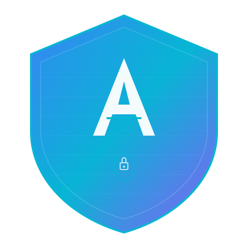

# APEX SOC

### Enterprise Threat Intelligence Platform

**Real-time threat intelligence • Interactive 3D globe visualization • Security Operations Center**

[](#)
[](#license)
[](#)
[](#technology-stack)
[](#technology-stack)
[](#technology-stack)
[](#technology-stack)
[](#technology-stack)

[](#)
[](#)
[](#)
[](#accessibility)

<br />

<!-- HERO BANNER PLACEHOLDER -->
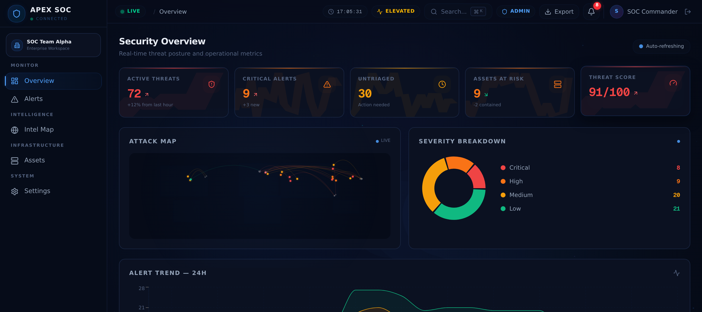

> 📸 **Banner placeholder** — Replace `docs/images/banner.png` with a high-resolution screenshot or animated GIF of the dashboard. Recommended dimensions: 1280×640px. Consider using a panoramic shot of the Intel Map with active threat arcs.

</div>

---

## Table of Contents

- [Introduction](#introduction)
- [Features](#features)
- [Screenshots](#screenshots)
- [Architecture](#architecture)
- [Application Flow](#application-flow)
- [Project Structure](#project-structure)
- [Technology Stack](#technology-stack)
- [Installation](#installation)
- [Environment Variables](#environment-variables)
- [Scripts](#scripts)
- [Security Features](#security-features)
- [Performance](#performance)
- [UI Showcase](#ui-showcase)
- [Development Principles](#development-principles)
- [Roadmap](#roadmap)
- [Contributing](#contributing)
- [License](#license)
- [Acknowledgements](#acknowledgements)

---

## Introduction

**APEX SOC** is an enterprise-grade Security Operations Center platform built for real-time threat intelligence, security monitoring, and incident response. It combines an immersive dark-themed interface with interactive 3D geospatial visualization to deliver a unified command view for security analysts and SOC teams.

The platform provides a cohesive set of capabilities designed around the operational workflow of a modern SOC:

- **Real-Time Threat Intelligence** — A continuously updating feed of simulated threat events, attack correlations, and adversary activity mapped across global regions. Each event is enriched with severity classification, attack vector attribution, and geolocation data.
- **Interactive 3D Globe Visualization** — A cinematic Three.js-powered globe rendering atmospheric effects, cloud layers, and real-time attack arcs that trace threat origins and targets across continents. The globe supports click-to-investigate interactions and smooth cinematic camera transitions.
- **Security Operations Center Dashboard** — A unified dashboard presenting KPI cards, severity distributions, trend analytics, and a condensed threat stream — all synchronized with the live data feed and designed for at-a-glance situational awareness.
- **Alert Investigation Console** — A full-featured alert triage system with multi-axis filtering (severity, status, attack type, search), bulk operations, severity escalation, and a detail drawer for deep-dive analysis per alert.
- **Asset Inventory & Network Topology** — A multi-view asset management module supporting card, table, and interactive topology visualizations. Assets are categorized by type (Server, Workstation, Network Device, IoT, Cloud Instance, Mobile) with risk scoring and status tracking.
- **Enterprise Design System** — A meticulously crafted dark theme with glassmorphism effects, animated gradient borders, pulse indicators, scan-line animations, and a 50+ token design system ensuring visual consistency across every surface.

APEX SOC is built as a single-page application on Next.js 16 with React 19, leveraging the App Router for server-side rendering capabilities while operating as a client-driven interactive experience. The entire platform is architected for extensibility — from the Zustand state layer to the modular component structure — allowing teams to integrate real backends, SIEM connectors, and live data pipelines behind the existing simulation layer.

> **Note:** The current release operates with simulated real-time data feeds. No actual network traffic is monitored, and no real security actions are performed. The platform serves as a production-quality reference architecture for SOC visualization and interaction design.

---

## Features

<table>
<tr>
<td width="50%">

### 🌐 Threat Intelligence
| Feature | Description |
|---------|-------------|
| Real-Time Threat Feed | Live-streaming threat events with auto-refresh |
| Attack Correlation | Link related events across sources and regions |
| Adversary Profiling | Track known threat actor patterns and TTPs |
| Geolocation Mapping | Plot threats on interactive 3D globe |
| IOC Indicators | Extract and display indicators of compromise |

</td>
<td width="50%">

### 🗺️ Intel Map
| Feature | Description |
|---------|-------------|
| 3D Globe Rendering | Cinematic Three.js globe with atmosphere shaders |
| Attack Arc Visualization | Animated threat arcs between source and target |
| Click-to-Investigate | Interactive threat detail panels on selection |
| Cinematic Camera | Smooth orbital and zoom camera transitions |
| Cloud & Star Effects | Atmospheric rendering with cloud layers and star fields |

</td>
</tr>
<tr>
<td width="50%">

### 📊 Dashboard
| Feature | Description |
|---------|-------------|
| KPI Cards | Animated counters for threats, alerts, assets, risk score |
| Severity Distribution | Donut chart for threat severity breakdown |
| Trend Analytics | Area chart for 24-hour threat trend tracking |
| Live Alert Feed | Condensed real-time alert mini-table |
| Mini Attack Map | Compact threat visualization overview |

</td>
<td width="50%">

### 🚨 Alert Console
| Feature | Description |
|---------|-------------|
| Multi-Axis Filtering | Filter by severity, status, attack type, keyword |
| Bulk Operations | Select and triage multiple alerts simultaneously |
| Alert Detail Drawer | Slide-out panel for per-alert deep investigation |
| Severity Escalation | Promote or demote alert severity levels |
| Status Transitions | Track alert lifecycle from new to resolved |

</td>
</tr>
<tr>
<td width="50%">

### 🖥️ Asset Management
| Feature | Description |
|---------|-------------|
| Card View | Visual asset cards with risk scoring |
| Table View | Sortable, filterable TanStack data grid |
| Network Topology | Interactive force-directed graph visualization |
| Asset Categorization | Servers, workstations, IoT, cloud, mobile, network |
| Risk Scoring | Per-asset risk assessment indicators |

</td>
<td width="50%">

### ⚙️ Platform
| Feature | Description |
|---------|-------------|
| Command Palette | `Ctrl+K` / `Cmd+K` keyboard-first navigation |
| Notification Center | Real-time notification drawer with severity badges |
| Dark Enterprise Theme | Full dark mode with glassmorphism effects |
| Responsive Layout | Adaptive sidebar, panels, and grid layouts |
| Accessibility | WCAG AA compliant, keyboard navigable, ARIA labeled |

</td>
</tr>
</table>

---

## Screenshots

> 📸 **Screenshot placeholders** — Replace each image path with an actual screenshot or animated GIF. Recommended format: PNG at 1280×720 or GIF at 800×450 for animations.

### Dashboard

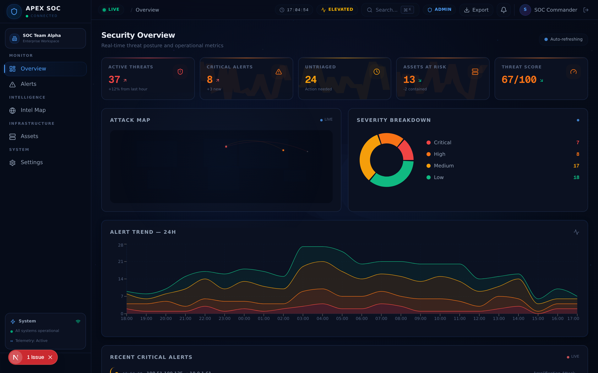

*The SOC dashboard presenting real-time KPI cards, severity distribution, threat trends, and a condensed alert feed — all synchronized with the live data stream.*

### Alerts

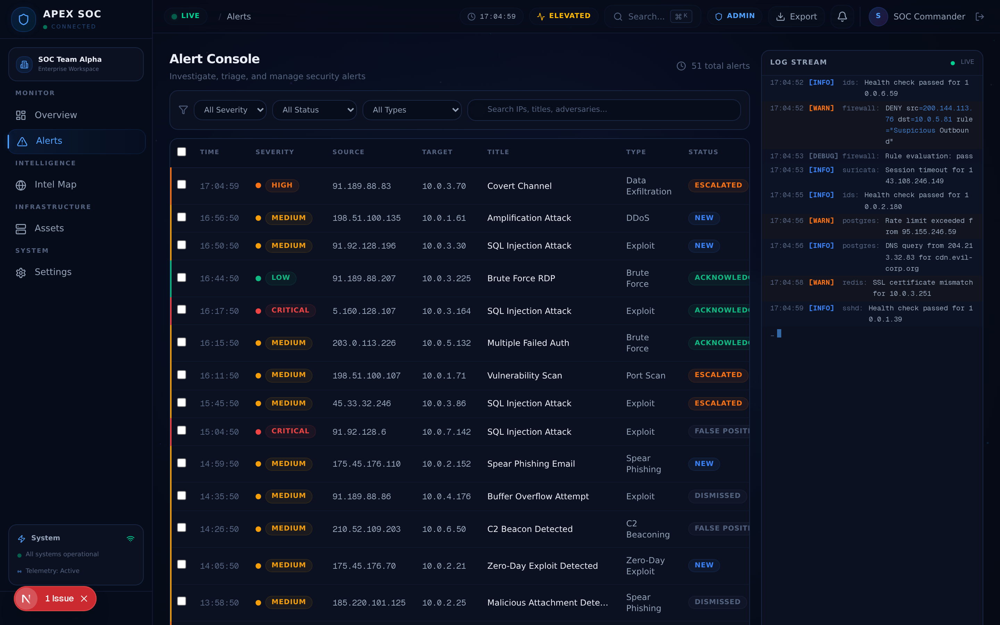

*The alert investigation console with multi-axis filtering, bulk triage operations, and a detail drawer for per-alert deep analysis.*

### Intel Map

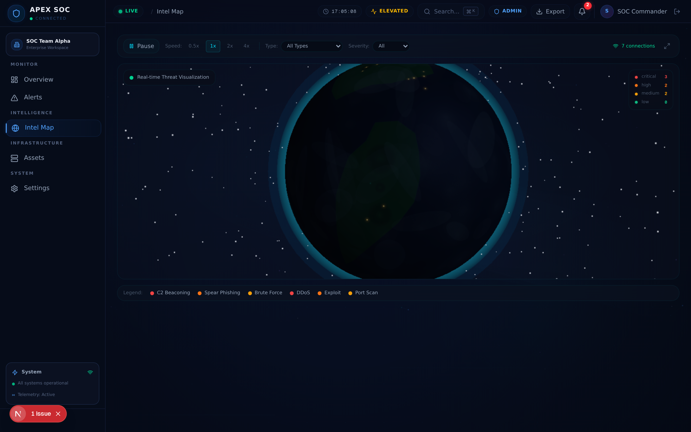

*The interactive 3D globe with cinematic rendering, atmospheric shaders, and real-time attack arc visualization tracing threat origins and targets.*

### Assets

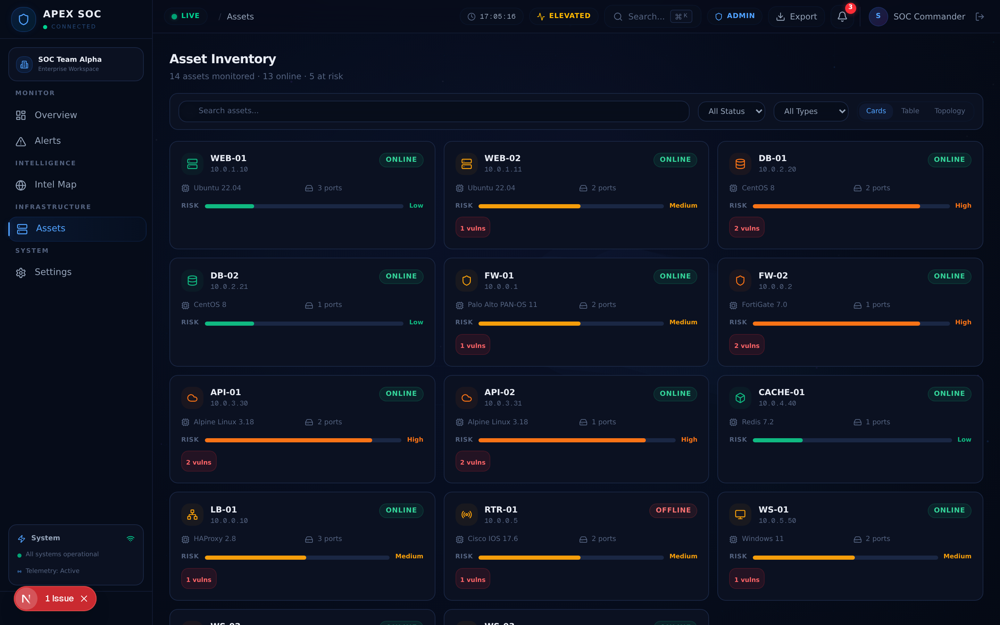

*The asset inventory in card view with risk scoring, status indicators, and type categorization.*

### Network Topology

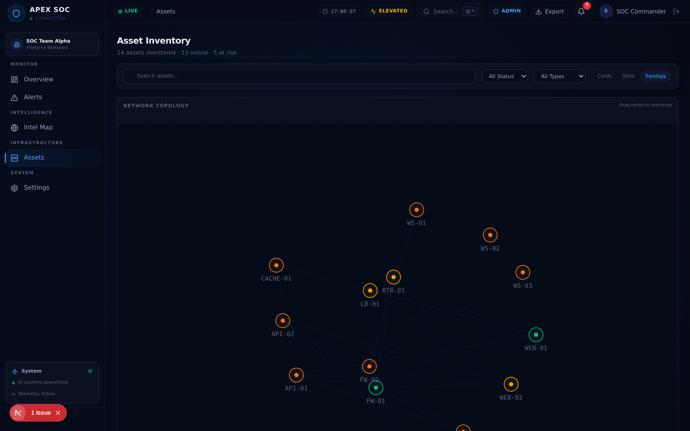

*The force-directed network topology graph showing asset relationships, traffic flow, and edge pulse animations.*

### Settings

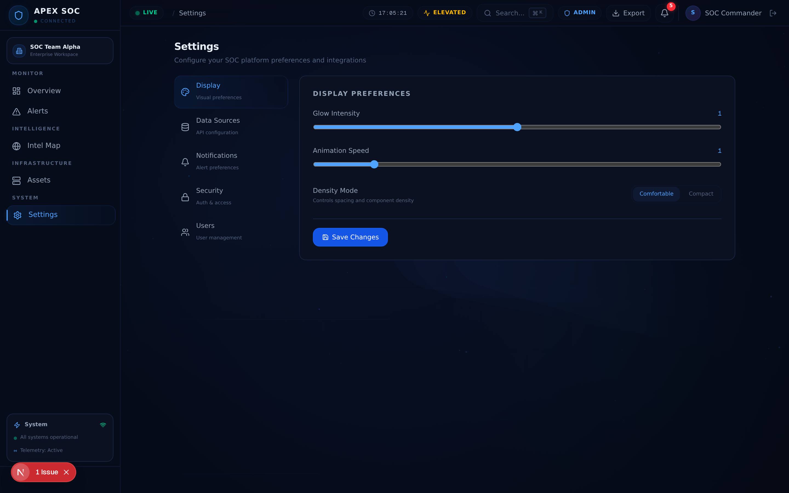

*The settings center with display preferences, data source configuration, notification rules, and security policies.*

### Login

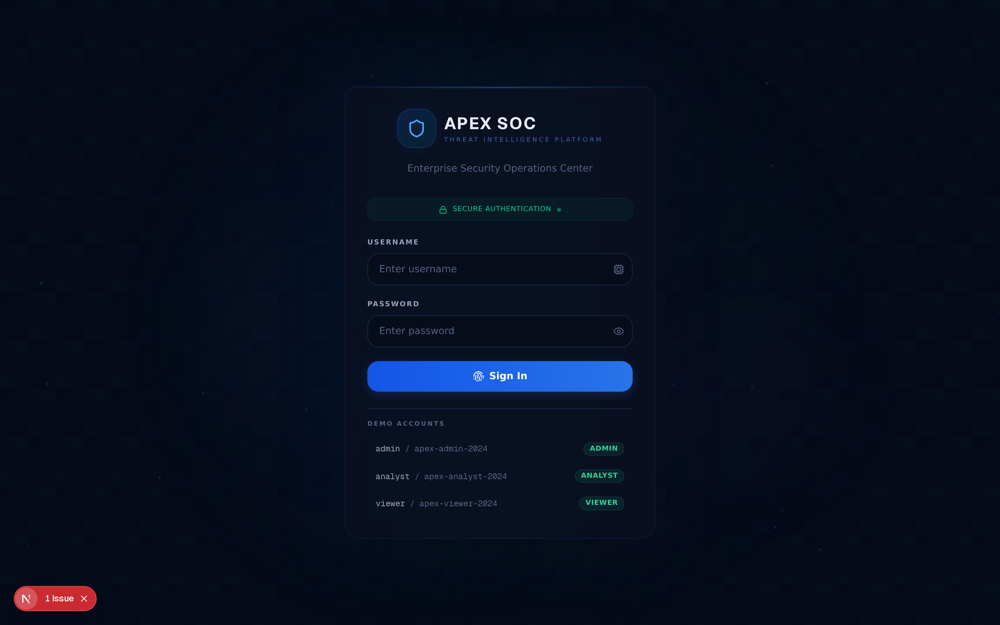

*The login screen with the animated cyber background, form validation, and role-based authentication.*

---

## Architecture

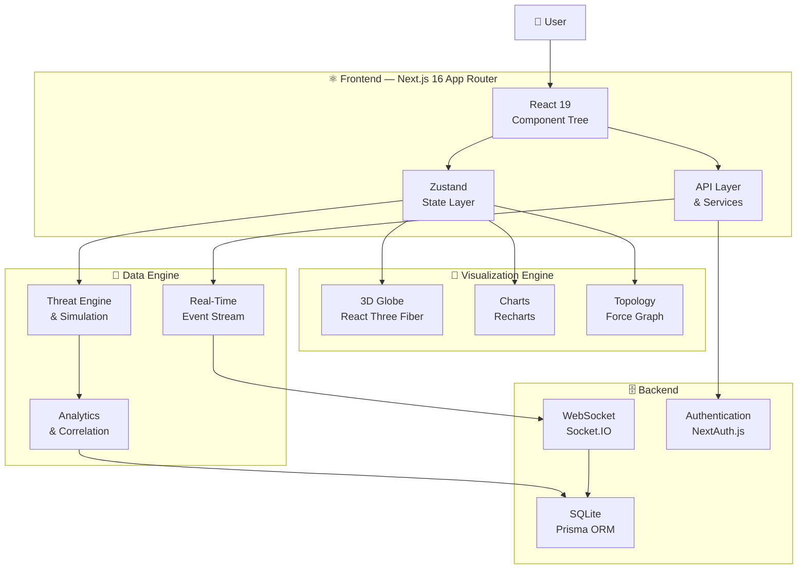

---

## Application Flow

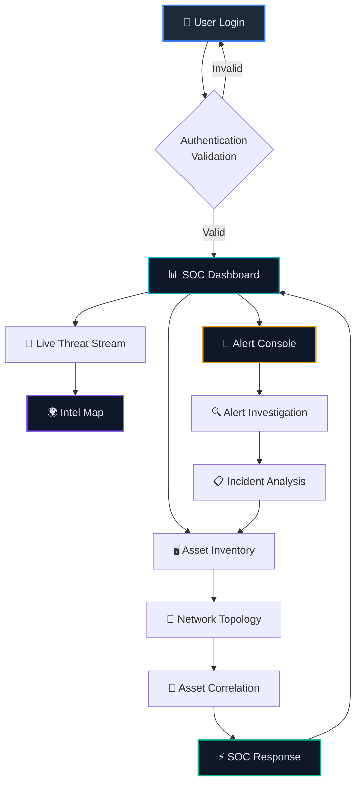

---

## Project Structure

```
apex-soc/
├── public/                          # Static assets served directly
│   ├── logo.svg                     # APEX SOC logo
│   └── robots.txt                   # Search engine directives
│
├── src/
│   ├── app/                         # Next.js App Router
│   │   ├── layout.tsx               # Root layout — dark theme, Geist fonts, Toaster
│   │   ├── page.tsx                 # SPA shell — view router, auth gate, real-time feeds
│   │   ├── globals.css              # Enterprise design system — 640 lines of tokens & effects
│   │   └── api/
│   │       └── route.ts             # API route placeholder
│   │
│   ├── components/
│   │   ├── soc/                     # Domain-specific SOC components
│   │   │   ├── login-page.tsx       # Authentication screen with role-based login
│   │   │   ├── sidebar.tsx          # Collapsible navigation with workspace switcher
│   │   │   ├── topbar.tsx           # Top navigation bar with search & status
│   │   │   ├── dashboard-view.tsx   # KPI cards, charts, mini map, alert feed
│   │   │   ├── alerts-view.tsx      # Investigation console with filters & triage
│   │   │   ├── intel-map-view.tsx   # 3D globe threat map (dynamically imported)
│   │   │   ├── assets-view.tsx      # Asset inventory — card, table, topology views
│   │   │   ├── settings-view.tsx    # Settings center — display, data, security
│   │   │   ├── log-stream.tsx       # Real-time scrolling log output
│   │   │   ├── notification-drawer.tsx # Slide-out notification panel
│   │   │   ├── command-palette.tsx  # Ctrl+K / Cmd+K command search
│   │   │   ├── cyber-background.tsx # Animated gradient & particle background
│   │   │   └── three-globe.tsx      # Three.js globe wrapper (SSR-safe)
│   │   │
│   │   ├── globe/                   # 3D globe sub-system (11 modules)
│   │   │   ├── globe-scene.tsx      # Scene orchestrator — lights, camera, post-processing
│   │   │   ├── earth-mesh.tsx       # Earth sphere geometry & texture mapping
│   │   │   ├── earth-textures.ts    # Texture loading & caching
│   │   │   ├── clouds.tsx           # Animated cloud layer overlay
│   │   │   ├── atmosphere.tsx       # Atmospheric glow — custom GLSL shader
│   │   │   ├── background-effects.tsx # Star field & deep space rendering
│   │   │   ├── cinematic-camera.tsx # Smooth orbital & zoom camera transitions
│   │   │   ├── globe-interaction.tsx # Click & hover event handling
│   │   │   ├── globe-utils.ts       # Geospatial math, lat/lng conversions
│   │   │   ├── threat-visualization.tsx # Attack arc rendering with animation
│   │   │   ├── attack-info-panel.tsx # Threat detail overlay panel
│   │   │   └── shaders/
│   │   │       └── index.ts         # Custom GLSL vertex & fragment shaders
│   │   │
│   │   └── ui/                      # shadcn/ui component library (40+ primitives)
│   │       ├── accordion.tsx        ├── hover-card.tsx       ├── select.tsx
│   │       ├── alert.tsx            ├── input-otp.tsx        ├── separator.tsx
│   │       ├── alert-dialog.tsx     ├── input.tsx            ├── sheet.tsx
│   │       ├── avatar.tsx           ├── label.tsx            ├── sidebar.tsx
│   │       ├── badge.tsx            ├── menubar.tsx          ├── skeleton.tsx
│   │       ├── button.tsx           ├── navigation-menu.tsx  ├── slider.tsx
│   │       ├── calendar.tsx         ├── pagination.tsx       ├── sonner.tsx
│   │       ├── card.tsx             ├── popover.tsx          ├── switch.tsx
│   │       ├── carousel.tsx         ├── progress.tsx         ├── table.tsx
│   │       ├── chart.tsx            ├── radio-group.tsx      ├── tabs.tsx
│   │       ├── checkbox.tsx         ├── resizable.tsx        ├── textarea.tsx
│   │       ├── collapsible.tsx      ├── scroll-area.tsx      ├── toast.tsx
│   │       ├── command.tsx          ├── context-menu.tsx      ├── toggle.tsx
│   │       ├── dialog.tsx           ├── dropdown-menu.tsx     ├── toggle-group.tsx
│   │       ├── drawer.tsx           └── form.tsx              └── tooltip.tsx
│   │
│   ├── stores/                      # Zustand state management
│   │   ├── ui-store.ts             # Auth, navigation, dashboard stats, settings, notifications
│   │   ├── alert-store.ts          # Alerts, triage, filters, bulk operations
│   │   ├── asset-store.ts          # Assets, topology, search, filters
│   │   └── globe-store.ts          # Threats, camera, interactions, FPS tracking
│   │
│   ├── hooks/                       # Custom React hooks
│   │   ├── use-toast.ts            # Toast notification dispatch
│   │   └── use-mobile.ts           # Responsive breakpoint detection
│   │
│   └── lib/                         # Shared utilities & data layer
│       ├── constants.ts             # Types, enums, color maps, adversary profiles, geo coords
│       ├── mock-data.ts             # Comprehensive mock data generators
│       ├── formatters.ts            # Date, time, number formatting utilities
│       ├── exporters.ts             # CSV & PDF export utilities
│       ├── db.ts                    # Prisma client singleton
│       └── utils.ts                 # cn() — clsx + tailwind-merge
│
├── prisma/
│   └── schema.prisma                # Database schema — SQLite, User & Post models
│
├── db/
│   └── custom.db                    # SQLite database file
│
├── examples/
│   └── websocket/
│       ├── server.ts                # Socket.IO WebSocket server (port 3003)
│       └── frontend.tsx             # WebSocket client integration example
│
├── docs/                            # Documentation & assets
│   └── images/                      # Screenshots, banners, diagrams
│
├── .env                             # Environment variables
├── package.json                     # Project manifest & scripts
├── next.config.ts                   # Next.js configuration
├── tailwind.config.ts               # Tailwind CSS design tokens
├── tsconfig.json                    # TypeScript configuration
├── components.json                  # shadcn/ui component registry
├── postcss.config.mjs               # PostCSS plugins
├── eslint.config.mjs                # ESLint rules
└── Caddyfile                        # Caddy reverse proxy configuration
```

---

## Technology Stack

| Category | Technology | Version | Purpose |
|----------|-----------|---------|---------|
| **Framework** | [Next.js](https://nextjs.org/) | 16 | App Router, SSR, standalone output |
| **Language** | [TypeScript](https://www.typescriptlang.org/) | 5 | Static type checking, DX |
| **UI Library** | [React](https://react.dev/) | 19 | Component architecture, concurrent features |
| **Styling** | [Tailwind CSS](https://tailwindcss.com/) | 4 | Utility-first CSS with design tokens |
| **Components** | [shadcn/ui](https://ui.shadcn.com/) | Latest | 40+ Radix UI-based primitives |
| **Primitives** | [Radix UI](https://www.radix-ui.com/) | Latest | Accessible headless components |
| **3D Graphics** | [Three.js](https://threejs.org/) | r170 | WebGL globe & threat visualization |
| **3D React** | [React Three Fiber](https://docs.pmnd.rs/react-three-fiber) | Latest | Declarative Three.js for React |
| **3D Helpers** | [@react-three/drei](https://github.com/pmndrs/drei) | Latest | Camera controls, helpers, effects |
| **Post-Processing** | [@react-three/postprocessing](https://github.com/pmndrs/postprocessing) | Latest | Bloom, SSAO, vignette effects |
| **Animation** | [Framer Motion](https://www.framer.com/motion/) | Latest | Page transitions, micro-interactions |
| **Animation** | [GSAP](https://gsap.com/) | Latest | Advanced timeline animations |
| **State** | [Zustand](https://zustand-demo.pmnd.rs/) | 5 | Lightweight global state management |
| **Data Fetching** | [TanStack Query](https://tanstack.com/query) | 5 | Server state, caching, synchronization |
| **Data Table** | [TanStack Table](https://tanstack.com/table) | 8 | Headless data grid with sorting & filtering |
| **Charts** | [Recharts](https://recharts.org/) | Latest | Area, donut, and trend charts |
| **Forms** | [React Hook Form](https://react-hook-form.com/) | Latest | Performant form validation |
| **Validation** | [Zod](https://zod.dev/) | Latest | Schema validation & type inference |
| **Database** | [Prisma](https://www.prisma.io/) | Latest | Type-safe ORM for SQLite |
| **Auth** | [NextAuth.js](https://next-auth.js.org/) | 4 | Authentication framework |
| **WebSocket** | [Socket.IO](https://socket.io/) | Latest | Real-time bidirectional communication |
| **Toast** | [Sonner](https://sonner.emilkowal.dev/) | Latest | Toast notification system |
| **Theming** | [next-themes](https://github.com/pacocoursey/next-themes) | Latest | Dark mode class-based theming |
| **Icons** | [Lucide React](https://lucide.dev/) | Latest | Consistent icon library |
| **i18n** | [next-intl](https://next-intl.dev/) | 4 | Internationalization framework |
| **Markdown** | [react-markdown](https://github.com/remarkjs/react-markdown) | Latest | Markdown rendering |
| **MDX** | [MDX Editor](https://mdxeditor.dev/) | Latest | Rich text editing |
| **DnD** | [dnd-kit](https://dndkit.com/) | Latest | Drag and drop interactions |
| **Build** | [Vite](https://vitejs.dev/) (via Next.js) | — | Fast bundling & HMR |
| **Lint** | [ESLint](https://eslint.org/) | 9 | Code quality enforcement |
| **Format** | [Prettier](https://prettier.io/) | Latest | Code formatting |
| **Runtime** | [Bun](https://bun.sh/) | Latest | JavaScript runtime & package manager |

---

## Installation

### Prerequisites

- **Node.js** ≥ 18.x
- **Bun** ≥ 1.x (recommended) or npm ≥ 9.x
- **Git** ≥ 2.x

### Quick Start

```bash
# 1. Clone the repository
git clone https://github.com/your-org/apex-soc.git
cd apex-soc

# 2. Install dependencies
bun install

# 3. Set up environment variables
cp .env.example .env

# 4. Initialize the database
bun run db:push
bun run db:generate

# 5. Start the development server
bun run dev
```

The application will be available at **http://localhost:3000**.

### Default Login Credentials

| Username | Password | Role | Display Name |
|----------|----------|------|-------------|
| `admin` | `apex-admin-2024` | Admin | SOC Commander |
| `analyst` | `apex-analyst-2024` | Analyst | Jane Reyes |
| `viewer` | `apex-viewer-2024` | Viewer | Guest Observer |

> ⚠️ **Important:** These are default development credentials. In production, replace them with proper authentication via NextAuth.js and a secure identity provider.

### Production Build

```bash
# Build for production
bun run build

# Start production server
bun run start
```

The production build uses Next.js standalone output mode with Bun runtime for optimal performance.

### Preview Production Build

```bash
bun run build
bun run preview
```

---

## Environment Variables

### `.env.example`

```bash
# ─── Database ───────────────────────────────────────────
DATABASE_URL="file:./db/custom.db"

# ─── Authentication ─────────────────────────────────────
NEXTAUTH_SECRET="your-nextauth-secret-change-me"
NEXTAUTH_URL="http://localhost:3000"

# ─── Application ────────────────────────────────────────
NEXT_PUBLIC_APP_NAME="APEX SOC"
NEXT_PUBLIC_APP_VERSION="0.2.0"
NEXT_PUBLIC_APP_URL="http://localhost:3000"

# ─── WebSocket (Optional) ──────────────────────────────
WEBSOCKET_PORT=3003
WEBSOCKET_ENABLED=false

# ─── Data Simulation ───────────────────────────────────
NEXT_PUBLIC_SIMULATION_INTERVAL=1500
NEXT_PUBLIC_MAX_LOG_LINES=200

# ─── Globe Configuration ───────────────────────────────
NEXT_PUBLIC_GLOBE_FPS_CAP=60
NEXT_PUBLIC_GLOBE_AUTO_ROTATE=true
NEXT_PUBLIC_GLOBE_ROTATION_SPEED=0.001
```

> 📋 Copy `.env.example` to `.env` and replace placeholder values with your configuration. Variables prefixed with `NEXT_PUBLIC_` are exposed to the browser.

---

## Scripts

| Script | Command | Description |
|--------|---------|-------------|
| `dev` | `bun run dev` | Start development server on port 3000 with live logging |
| `build` | `bun run build` | Production build with standalone output |
| `start` | `bun run start` | Start production server via Bun runtime |
| `preview` | `bun run preview` | Preview the production build locally |
| `lint` | `bun run lint` | Run ESLint on all source files |
| `format` | `bun run format` | Format code with Prettier |
| `db:push` | `bun run db:push` | Push Prisma schema to database |
| `db:generate` | `bun run db:generate` | Generate Prisma client |
| `db:migrate` | `bun run db:migrate` | Run database migrations |
| `db:reset` | `bun run db:reset` | Reset database to initial state |

---

## Security Features

APEX SOC provides a comprehensive visualization and monitoring interface for security operations. The following capabilities are designed for threat awareness and analysis:

<details>
<summary><strong>🔍 Threat Visualization</strong></summary>

- **3D Attack Arc Mapping** — Visualize threat origins and targets on an interactive globe with animated arc trajectories
- **Adversary Profiling** — Track known threat actor patterns including APT groups, hacktivist collectives, and script kiddie operations
- **Geolocation Intelligence** — Map threats to geographic coordinates with region-specific severity analysis
- **Attack Type Classification** — Categorize threats by vector: DDoS, Ransomware, Phishing, Data Exfiltration, Zero-Day, Brute Force, and more
- **Severity Scoring** — Real-time severity classification (Critical, High, Medium, Low, Info) with color-coded indicators

</details>

<details>
<summary><strong>📊 Security Dashboards</strong></summary>

- **KPI Monitoring** — Track active threats, open alerts, total assets, and organizational risk score in real time
- **Severity Distribution** — Visual breakdown of threats by severity level with donut chart visualization
- **Trend Analytics** — 24-hour threat trend analysis with area chart tracking
- **Live Alert Stream** — Continuously updating alert feed with severity badges and time-since-event indicators
- **Attack Mini Map** — Condensed geographic threat overview for rapid situational awareness

</details>

<details>
<summary><strong>🖥️ Asset Monitoring</strong></summary>

- **Asset Inventory** — Categorized inventory of servers, workstations, network devices, IoT, cloud instances, and mobile assets
- **Risk Scoring** — Per-asset risk assessment with visual severity indicators
- **Status Tracking** — Monitor asset status: Online, Offline, Compromised, Maintenance, Unknown
- **Network Topology** — Force-directed graph visualization of asset relationships and traffic flow
- **Edge Pulse Animation** — Animated connections showing active data flow between assets

</details>

<details>
<summary><strong>⚡ Real-Time Event Handling</strong></summary>

- **Simulated Threat Feed** — Auto-refreshing threat event stream with configurable interval
- **WebSocket Infrastructure** — Socket.IO server ready for real-time bidirectional data push
- **Live Log Stream** — Scrolling console output of security events and system activity
- **Notification Dispatch** — Real-time notification drawer with severity-based sorting
- **Command Palette** — Keyboard-first navigation (`Ctrl+K`) for rapid SOC operations

</details>

> **Disclaimer:** APEX SOC is a visualization and monitoring interface. It does not perform real-world security actions such as blocking traffic, isolating hosts, or modifying firewall rules. Integration with actual security infrastructure (SIEM, EDR, firewalls) requires backend development beyond the current scope.

---

## Performance

APEX SOC is engineered for smooth, responsive interaction even under sustained high-frequency data updates and complex 3D rendering.

<details>
<summary><strong>🚀 Optimization Techniques</strong></summary>

| Technique | Implementation | Impact |
|-----------|---------------|--------|
| **Code Splitting** | Next.js automatic route-based splitting + dynamic imports for 3D globe | Reduces initial bundle size; globe loads only when Intel Map is accessed |
| **Lazy Loading** | `React.lazy()` + `Suspense` for heavy components (Three.js, topology) | Defers non-critical rendering until needed |
| **GPU Acceleration** | Three.js WebGL rendering pipeline with hardware acceleration | Offloads 3D computation to GPU, freeing main thread |
| **Memoization** | `React.memo()`, `useMemo()`, `useCallback()` on expensive renders | Prevents unnecessary re-renders in KPI cards, charts, and lists |
| **Virtualization** | Windowed rendering for large alert and asset lists | Renders only visible rows, maintaining scroll performance with thousands of items |
| **Animation Batching** | Framer Motion layout animations + requestAnimationFrame scheduling | Groups DOM mutations into single paint frames |
| **Standalone Output** | Next.js `output: "standalone"` with Bun runtime | Minimal production server with reduced cold-start time |
| **FPS Capping** | Configurable globe frame rate cap (`NEXT_PUBLIC_GLOBE_FPS_CAP`) | Limits GPU usage when full frame rate is unnecessary |
| **State Isolation** | Zustand store separation (UI, Alert, Asset, Globe) | Component re-renders only when relevant store slices update |
| **SSR-Safe Imports** | Dynamic import with `ssr: false` for Three.js components | Prevents server-side rendering failures with WebGL-dependent code |

</details>

<details>
<summary><strong>📈 Performance Benchmarks</strong></summary>

> 📋 **Placeholder** — Add benchmark results here using Lighthouse, WebPageTest, or custom metrics.
>
> Recommended metrics to track:
> - **First Contentful Paint (FCP)** — Target: < 1.2s
> - **Largest Contentful Paint (LCP)** — Target: < 2.5s
> - **Time to Interactive (TTI)** — Target: < 3.0s
> - **Cumulative Layout Shift (CLS)** — Target: < 0.1
> - **Globe FPS** — Target: ≥ 30fps on mid-range hardware

</details>

---

## UI Showcase

<details>
<summary><strong>🎨 Design System</strong></summary>

APEX SOC features a meticulously crafted enterprise design system built on a 50+ token CSS custom property architecture:

### Color Palette

| Token | Hex | Usage |
|-------|-----|-------|
| Deep Navy | `#060b18` | Primary background |
| Dark Slate | `#0f172a` | Surface backgrounds |
| Graphite | `#1e293b` | Card and panel surfaces |
| SOC Blue | `#3b82f6` | Primary interactive color |
| Electric Cyan | `#06b6d4` | Accent highlights, links |
| Emerald | `#10b981` | Success, online status |
| Amber | `#f59e0b` | Warning, medium severity |
| Orange | `#f97316` | High severity indicators |
| Red | `#ef4444` | Critical alerts, errors |
| Purple | `#8b5cf6` | Special accents, intel |

### Visual Effects

- **Glassmorphism** — Backdrop blur on dialogs, panels, command palette, and overlays (`.glass`, `.glass-heavy`, `.glass-light`)
- **Animated Gradient Borders** — CSS conic-gradient border rotation on interactive cards
- **Pulse Indicators** — Severity-aware pulse rings on KPI cards and status badges
- **Scan-Line Animation** — Subtle CRT-style scan effect on focused elements
- **Shimmer Skeletons** — Loading state placeholders with gradient sweep animation
- **Cyber Background** — Multi-layer animated gradient with particle effects

### Typography

- **Font Family** — Geist Sans (headings, body) + Geist Mono (code, logs, data)
- **Scale** — 12px base with consistent 4px spacing increments
- **Weight Hierarchy** — 400 (body) → 500 (labels) → 600 (headings) → 700 (KPI values)

</details>

<details>
<summary><strong>✨ Animations & Micro-Interactions</strong></summary>

| Animation | Trigger | Duration | Easing |
|-----------|---------|----------|--------|
| Page Transition | View change | 300ms | Spring (stiffness: 300, damping: 30) |
| Card Hover Lift | Mouse enter | 200ms | Ease-out |
| KPI Counter | Value change | 800ms | Ease-out with stagger |
| Alert Row Flash | New alert | 500ms | Ease-in-out |
| Globe Camera | Click target | 1200ms | Cubic bezier (0.4, 0, 0.2, 1) |
| Attack Arc | Threat event | Continuous | Linear with opacity fade |
| Sidebar Collapse | Toggle | 250ms | Spring (stiffness: 400, damping: 35) |
| Notification Slide | Drawer open | 300ms | Spring (stiffness: 300, damping: 30) |
| Command Palette | Ctrl+K | 200ms | Spring (stiffness: 500, damping: 35) |
| Gradient Border | Card focus | 3s loop | Linear rotation |

</details>

---

## Development Principles

| Principle | Description |
|-----------|-------------|
| **Reusable Components** | Every UI element is built as a composable, reusable component following shadcn/ui patterns. SOC-specific components are isolated in `components/soc/` with clear prop interfaces and TypeScript types. |
| **Scalable Architecture** | The application is structured for growth. New views, data sources, and integrations can be added without restructuring existing code. The Zustand store layer supports feature-based slicing. |
| **SOLID Principles** | Single responsibility per component, open for extension through composition, dependency inversion via React context and store injection. Each globe module handles exactly one concern. |
| **Maintainability** | Consistent naming conventions, comprehensive TypeScript types, and clear file organization. The 11-module globe sub-system demonstrates how complex features can be decomposed into maintainable units. |
| **Performance** | Every rendering decision is intentional — from memoized KPI cards to dynamically imported Three.js components. The platform avoids unnecessary re-renders and defers heavy computation. |
| **Accessibility** | WCAG AA compliance through Radix UI primitives, ARIA attributes, keyboard navigation, and focus management. The command palette provides a keyboard-first interaction model. |
| **Type Safety** | End-to-end TypeScript from Prisma schema to React props. Zod schemas provide runtime validation, and TypeScript strict mode catches errors at compile time. |

---

## Roadmap

- [x] Core SOC dashboard with KPI cards and charts
- [x] Interactive 3D globe with attack arc visualization
- [x] Alert investigation console with multi-axis filtering
- [x] Asset inventory with card, table, and topology views
- [x] Command palette for keyboard-first navigation
- [x] Notification drawer with severity badges
- [x] Enterprise dark theme with glassmorphism effects
- [x] Real-time simulated threat feed
- [ ] Enhanced threat intelligence with STIX/TAXII integration
- [ ] Advanced analytics with correlation engine
- [ ] Multi-user roles with RBAC and audit logging
- [ ] Custom reporting and export templates
- [ ] SIEM integrations (Splunk, Elastic, QRadar)
- [ ] EDR connector framework (CrowdStrike, SentinelOne, Defender)
- [ ] Additional visualization modules (Sankey, chord, timeline)
- [ ] Real WebSocket data pipeline replacing simulation
- [ ] NextAuth.js production authentication with SSO/SAML
- [ ] Internationalization with next-intl (10+ languages)
- [ ] Mobile-responsive optimizations for tablet SOC workflows
- [ ] Automated testing suite (Vitest + Playwright)
- [ ] CI/CD pipeline with GitHub Actions
- [ ] Docker containerization and Kubernetes manifests

---

## Contributing

We welcome contributions from the community. Whether you're fixing a bug, adding a feature, improving documentation, or suggesting design enhancements — your input makes APEX SOC better.

### Getting Started

1. **Fork** the repository
2. **Create** a feature branch: `git checkout -b feature/your-feature-name`
3. **Commit** your changes: `git commit -m "feat: add your feature"`
4. **Push** to your branch: `git push origin feature/your-feature-name`
5. **Open** a Pull Request

### Contribution Guidelines

- Follow the existing code style and TypeScript conventions
- Write descriptive commit messages following [Conventional Commits](https://www.conventionalcommits.org/)
- Ensure your changes pass `bun run lint` without errors
- Add appropriate TypeScript types for any new props, state, or data structures
- Test your changes across all five views (Dashboard, Alerts, Intel Map, Assets, Settings)
- Keep pull requests focused — one feature or fix per PR

### Commit Convention

| Prefix | Usage |
|--------|-------|
| `feat:` | New feature |
| `fix:` | Bug fix |
| `refactor:` | Code restructuring |
| `style:` | Formatting, no logic change |
| `docs:` | Documentation |
| `test:` | Test additions |
| `chore:` | Build, tooling, dependencies |

---

## License

This project is licensed under the **MIT License**.

```
MIT License

Copyright (c) 2024 APEX SOC

Permission is hereby granted, free of charge, to any person obtaining a copy
of this software and associated documentation files (the "Software"), to deal
in the Software without restriction, including without limitation the rights
to use, copy, modify, merge, publish, distribute, sublicense, and/or sell
copies of the Software, and to permit persons to whom the Software is
furnished to do so, subject to the following conditions:

The above copyright notice and this permission notice shall be included in all
copies or substantial portions of the Software.

THE SOFTWARE IS PROVIDED "AS IS", WITHOUT WARRANTY OF ANY KIND, EXPRESS OR
IMPLIED, INCLUDING BUT NOT LIMITED TO THE WARRANTIES OF MERCHANTABILITY,
FITNESS FOR A PARTICULAR PURPOSE AND NONINFRINGEMENT. IN NO EVENT SHALL THE
AUTHORS OR COPYRIGHT HOLDERS BE LIABLE FOR ANY CLAIM, DAMAGES OR OTHER
LIABILITY, WHETHER IN AN ACTION OF CONTRACT, TORT OR OTHERWISE, ARISING FROM,
OUT OF OR IN CONNECTION WITH THE SOFTWARE OR THE USE OR OTHER DEALINGS IN THE
SOFTWARE.
```

---

## Acknowledgements

APEX SOC draws design and architectural inspiration from several categories of modern security and visualization software. The following acknowledgements recognize the communities and projects that informed our design decisions:

- **Cybersecurity Dashboard Design** — The visual language and interaction patterns found in modern SOC platforms including CrowdStrike Falcon, Microsoft Defender XDR, SentinelOne, IBM QRadar, Palo Alto Cortex, and Recorded Future informed our approach to threat visualization, alert triage, and analyst workflow design.
- **Open-Source Visualization** — The Three.js, React Three Fiber, and Drei ecosystems provide the foundation for our 3D globe rendering. The Recharts library powers our analytical chart components.
- **Enterprise UX Patterns** — The shadcn/ui and Radix UI projects established the component architecture and accessibility standards we follow. The glassmorphism design trend and dark-theme enterprise dashboards influenced our visual system.
- **Animation Libraries** — Framer Motion and GSAP enable the fluid interaction model that distinguishes APEX SOC from static dashboards.
- **State Management** — Zustand's minimal API and store composition pattern shaped our approach to global state architecture.

No endorsement, affiliation, or sponsorship by any of the above projects or companies is implied.

---

<div align="center">

**APEX SOC** — v0.2.0

Made with React & TypeScript

Enterprise Security Dashboard

[⬆ Back to Top](#apex-soc)

</div>
